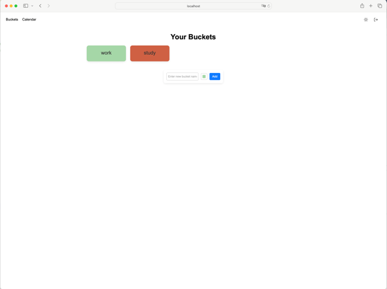

# **Smart To-Do Manager**

A cutting-edge task management application that combines AI-driven insights, a seamless user experience, and calendar integration. Powered by a React frontend, a Flask backend, and enhanced by the OpenAI API and Google Calendar API, this application takes productivity to the next level.

---

## **Table of Contents**
1. [Introduction](#introduction)  
2. [Features](#features)  
3. [Tech Stack](#tech-stack)  
4. [Installation and Setup](#installation-and-setup)  
5. [Usage](#usage)  
6. [Screenshots](#screenshots)  
7. [UML Sequence Diagram](#uml-sequence-diagram)  
8. [License](#license)  

---

## **Introduction**

Welcome to **Smart To-Do Manager**, your AI-assisted task management companion. This application is designed to streamline your workflow and boost productivity by leveraging:  
- **OpenAI API** for intelligent task recommendations and natural language processing.  
- **Google Calendar API** for real-time calendar integration, helping you visualize your tasks and deadlines.  

Whether you're managing daily chores, professional projects, or long-term goals, this app ensures you stay organized and efficient.

---

## **Features**
- **AI-Powered Suggestions**: Generate task suggestions and priority levels using the OpenAI API.  
- **Calendar Integration**: Synchronize tasks with your Google Calendar for enhanced scheduling.  
- **Secure Login**: Protect your data with robust authentication mechanisms.  
- **Task Management**: Create, edit, and delete tasks with a user-friendly interface.  
- **Calendar View**: Visualize your tasks with an intuitive calendar layout.  
- **Responsive Design**: Fully optimized for both desktop and mobile devices.  

---

## **Tech Stack**
- **Frontend**: React, Tailwind CSS  
- **Backend**: Flask, Flask-RESTful  
- **APIs**:  
  - OpenAI API for AI-driven features  
  - Google Calendar API for task synchronization  
- **Database**: MongoDB

---

## **Installation and Setup**

### Prerequisites
- Node.js (version X.X.X or higher)  
- Python (version X.X.X or higher)  
- npm or yarn  
- Virtual environment tools (`venv`)  
- Access to OpenAI and Google Calendar API credentials  

---

### Steps to Run the Project Locally

#### **Backend Setup**
1. Navigate to the `backend` directory:
   ```bash
   cd backend
2. Create and acitivate a Python virtual environment:
    ```bash 
    python -m venv venv
    source venv/bin/activate #Linux/mac
    venv\Scripts\activate #Windows
3. Install the required python packages:
    ```bash
    pip install -r requirements.txt
4. Configure API keys for OpenAI and Google Calendar in a `.env` file:
    ```bash
    OPENAI_API_KEY=<your_openai_api_key>
    GOOGLE_CALENDAR_API_KEY=<your_google_calendar_api_key>
5. Start the Flask Backedn:
    ```bash
    flask run

---

#### **Frontend Setup**
1. Navigate to the `frontend` directory
    ```bash
    cd frontend
2. Install Node.js dependencies
    ```bash
    npm install
3. Start the React frontend:
    ```bash
    npm run

---

## **Usage**

To use the application:

1. Open your browser and navigate to:  
    - Frontend: [http://localhost:3000/](http://localhost:3000/)  
    - Backend: [http://localhost:5000/](http://localhost:5000/)  
2. Log in or sign up to access your personalized task manager.  
3. Use the **AI Suggestions** feature to generate smart to-do items.  
4. Synchronize your tasks with Google Calendar for an integrated schedule view.  
5. Manage tasks through the to-do list or calendar interface.  

---

## **Screenshots**

Here are some screenshots of the application:

### **Login Page**  


### **Home Page**  


### **To-Do Item Page**  


### **Calendar Page -- Syncing**  


### **Calendar Page -- After Syncing**  


---

## **UML Sequence Diagram**

Below is the UML squence diagram illustrating the application's flow:


